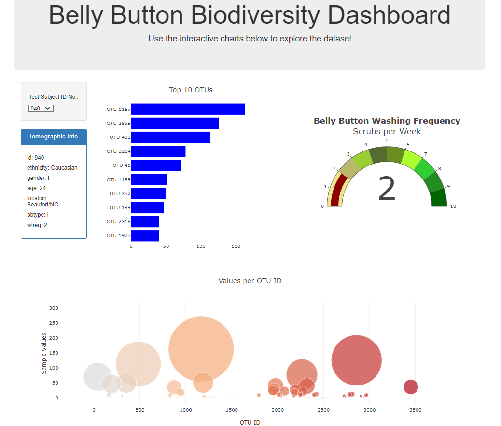

# belly-button-biodiversity

I built an interactive dashboard to explore the Belly Button Biodiversity datasetLinks to an external site., which catalogs the microbes that colonize human navels.

The dataset revealed that a small handful of microbial species (also called operational taxonomic units, or OTUs, in the study) were present in more than 70% of people, while the rest were relatively rare.

In this challenge, I uesd JavaScript to display data on an interactive dashboard. The JSON data was read from an external site using D3 and drop down was  populated.
Bar chart, bubble chart, and gauge chart were created with Plotly. 

I completed the task by taking the following steps:

   I used the D3 library to read in samples.json from the URL https://2u-data-curriculum-team.s3.amazonaws.com/dataviz-classroom/v1.1/14-Interactive-Web-Visualizations/02-Homework/samples.json.

   I created a horizontal bar chart with a dropdown menu to display the top 10 OTUs found in that individual.

   I created a bubble chart that displays each sample.

   I displayed the sample metadata, i.e., an individual's demographic information.

   I displayed each key-value pair from the metadata JSON object somewhere on the page.
   
   I finally set an update to all the plots when a new sample is selected.

   # Dashboard link
    https://chiomauche.github.io/Belly-Button-Biodiversity-Analysis/

References
Hulcr, J. et al. (2012) A Jungle in There: Bacteria in Belly Buttons are Highly Diverse, but Predictable. Retrieved from: http://robdunnlab.com/projects/belly-button-biodiversity/results-and-data/Links to an external site.

